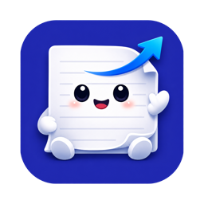
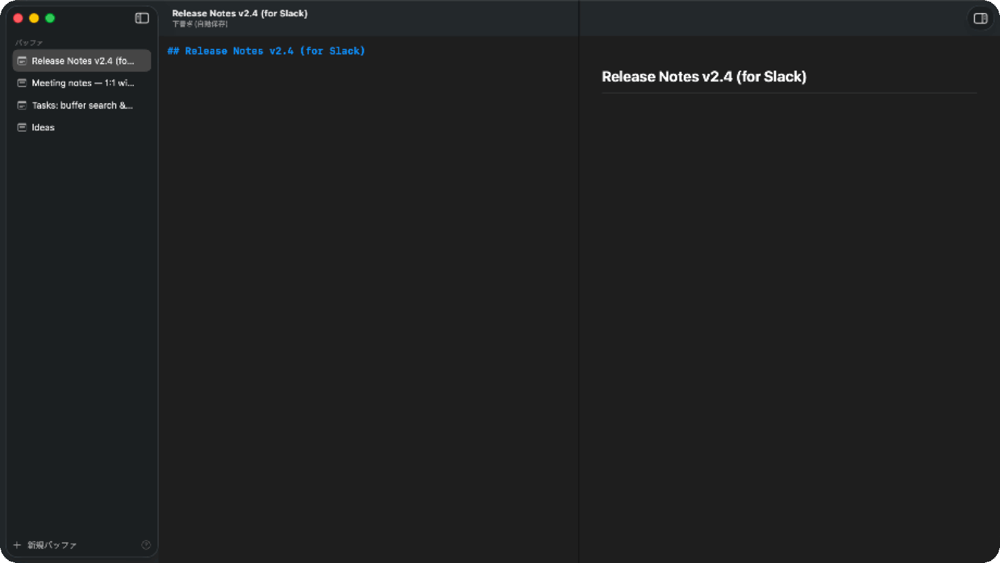

<p align="center"></p>
<h1 align="center">Editan</h1>
<p align="center"><strong>ここで書いて、どこへでも。</strong><br>ほかのアプリに貼る文章のための、Mac の小さな作業場所。</p>
<p align="center"><a href="https://kohey18.github.io/editan/ja/">Web サイト</a> · <a href="#はじめる">はじめる</a> · <a href="README.md">English</a> · <a href="LICENSE">MIT ライセンス</a></p>



次の AI プロンプト。言葉に迷うメール。チームへの報告。**Editan は、ほかのアプリに貼る文章を準備する macOS 専用エディタです。**

下書きして、必要なら文章を整えて、貼り付け先に合う書式でコピー。Editan のアカウントやクラウド同期はありません。編集・プレビューはオフラインで動作し、任意の Claude／Notion 連携は操作したときに文章を送信します。

> **開発初期のソフトウェアです。** 現在はソースからビルドして使います。公証済みダウンロードや App Store 版はまだありません。アプリの UI は日本語です。

## Editan でできること

- **保存先を考えずに下書き。** スクラッチバッファは Markdown ファイルとして自動保存。既存のテキストファイルも開けます。
- **予測できるコピー。** 通常の **⌘C は必ずプレーンテキスト**。Slack 用・リッチテキスト用は明示的に使い分けます。
- **Markdown を見ながら編集。** 構文の色分け、左右分割プレビュー、整形、リスト継続、コードブロックのコピー。
- **必要なときだけ文章変換。** Claude Code CLI で敬語化、カジュアル化、校正、要約、独自の指示。結果を確認してから置き換えられます。
- **Mac と日本語入力になじむ。** SwiftUI + AppKit、メニューバー、グローバルホットキー、定型文、IME 変換中の入力への配慮。スマート引用符・自動修正はオフ。

## ひとつの下書きから、次の場所へ

| 貼り付け先 | 操作 | ショートカット |
| --- | --- | --- |
| AI プロンプト、ターミナル、そのほか | プレーンテキストをコピー | ⌘C |
| Slack | Slack 向けテキストに変換してコピー | ⇧⌘C |
| Gmail、Pages など | HTML とプレーンテキストをコピー | ⌥⌘C |
| Notion | 設定した親ページ配下に新規ページを作成 | ⇧⌘N |

Slack 用コピーはメッセージを送信しません。Notion 送信は現在のバッファを API 経由で送ります。コピー後の表示は貼り付け先のアプリに依存します。

## はじめる

**必要なもの：** macOS 14 以降、フル版 **Xcode 26 以降**とそのコマンドラインツール、[Homebrew](https://brew.sh/)。固定した Markdown 依存ライブラリは Swift tools 6.2 を使用します。Editan のコードは Swift 5 言語モードです。

```sh
brew install xcodegen
git clone https://github.com/kohey18/editan.git
cd editan
./Scripts/install.sh
```

Release ビルドを `/Applications/Editan.app` にインストールします。同じ場所の既存アプリは置き換わります。Applications から起動し、起動後は **⌥⌘E** で呼び出せます。

1. **⌘N** で新しい下書きを作り、文章を書く。
2. **⇧⌘P** でプレビューを切り替え、**⇧⌘F** で Markdown を整形。
3. **⌘C**・**⇧⌘C**・**⌥⌘C** でコピーし、いつものアプリへ貼り付ける。

下書きは自動保存。既存ファイルは **⌘S** で保存します。下書きを閉じると、確認ダイアログの後にその内容を削除します。

### 任意：Claude による変換

[Claude Code CLI](https://code.claude.com/docs/en/overview) をインストールし、認証を済ませます。[SECURITY.md](SECURITY.md#claude-transforms) に記載のフラグに対応する新しいバージョンを使ってください。

設定（**⌘,**）→「変換」でモデルとテンプレートを選びます。文字を選択するか、未選択で全文を対象にし、「変換」メニューまたは **⌥⌘1–9** を実行。結果を確認して置き換え・コピーします。

ツール・MCP・スラッシュコマンド・フック・会話履歴の保存を無効にした `claude -p` を実行します（管理者の組織ポリシーは適用される場合があります）。**認証・利用枠・課金は CLI の設定に従います。** 常にサブスクリプション内で完結するという保証はありません。

### 任意：Notion に送信

1. Notion の Internal Integration を作成し、送り先の親ページに接続する。
2. 設定（**⌘,**）→「Notion」にトークンと親ページ ID を入力する。
3. **「トークンを Keychain に保存」**を押す。
4. **⇧⌘N** で現在のバッファから新しいページを作成する。

トークンは macOS Keychain に保存します。旧バージョンの設定値は、Notion 設定または送信機能を利用した際に移行し、成功後に旧設定を削除します。ad-hoc 署名での再ビルド後は Keychain のアクセス確認が出る場合があります。

## キーボードショートカット

⌘ Command · ⇧ Shift · ⌥ Option · ⌃ Control

| 操作 | キー | 操作 | キー |
| --- | --- | --- | --- |
| Editan を呼び出す | ⌥⌘E | プレーンコピー | ⌘C |
| 新しい下書き | ⌘N | Slack 用コピー | ⇧⌘C |
| 下書きの切り替え | ⌘1–9 | リッチテキストコピー | ⌥⌘C |
| 確認して閉じる | ⌘W | Notion に送信 | ⇧⌘N |
| ファイルを開く | ⌘O | Markdown 整形 | ⇧⌘F |
| 保存／別名で保存 | ⌘S／⇧⌘S | プレビュー切り替え | ⇧⌘P |
| 検索 | ⌘F | 定型文の挿入 | ⌃⌘1–9 |
| 設定 | ⌘, | 文章の変換 | ⌥⌘1–9 |

## データとプライバシー

| データ | 保存先・送信先 |
| --- | --- |
| 下書き | `~/Library/Application Support/Editan/Buffers/<uuid>.md` |
| 一覧・テンプレート | `~/Library/Application Support/Editan/` |
| 開いたファイル | 元の場所。明示的に保存 |
| Notion トークン | macOS Keychain。親ページ ID は設定に保存 |
| Claude 変換 | 選択範囲または全文を設定済み CLI 経由で送信 |
| Notion 送信 | 現在のバッファを Notion API に送信 |

解析、クラッシュ報告サービス、自動更新の通信、クラウド同期はありません。下書きは普通のファイルで、**Editan による暗号化は行いません**。プレビューは外部リソースを遮断し、生の HTML をエスケープします。リッチテキストとしてコピーした外部画像 URL は、貼り付け先が読み込む場合があります。詳細と脆弱性の報告方法は [SECURITY.md](SECURITY.md) にあります。

## 開発・参加

```sh
xcodegen generate
open Editan.xcodeproj
xcodebuild -project Editan.xcodeproj -scheme Editan \
  -configuration Debug -derivedDataPath build/DerivedData build
xcodebuild -project Editan.xcodeproj -scheme EditanSecurityTests \
  -destination 'platform=macOS' -derivedDataPath build/DerivedData test
```

`project.yml` が構成の正本です。Swift ファイルの追加・移動・削除後は再生成してください。セキュリティテストはアプリを起動せず、実際の Notion 認証情報も読みません。

[開発ガイド](CONTRIBUTING.md) · [Web サイトの更新](docs/website.md) · [依存ライブラリのライセンス](THIRD_PARTY_NOTICES.md)

今後の候補はプレビューのスクロール同期、下書き検索・固定・並べ替え、変換差分、LLM プロバイダ追加、英語 UI、署名・公証付き配布です。これらは未実装のアイデアです。

バグ報告、ドキュメント、日本語 IME での動作確認、小さな改善を歓迎します。[Issue](https://github.com/kohey18/editan/issues) または Pull Request で参加してください。

## ライセンス

[MIT](LICENSE) © 2026 [kohey18](https://github.com/kohey18)。[swift-markdown](https://github.com/swiftlang/swift-markdown)、[swift-cmark](https://github.com/swiftlang/swift-cmark)、[highlight.js](https://highlightjs.org/) を使用しています。
