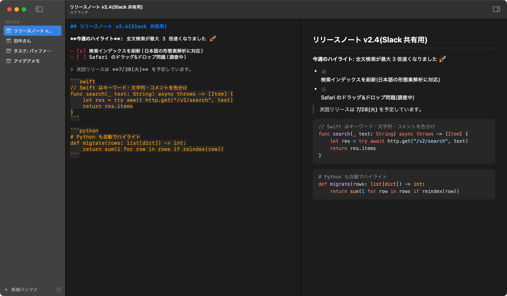

# Editan

A staging editor for macOS: **write → transform → copy → paste anywhere**.

Editan is the place to write text that ends up in other apps — prompts for Claude Code, email bodies for Gmail, Markdown for Slack or Notion. No cloud sync, macOS only.



## Features

- **⌘C always copies plain text** — rich text never sneaks into your clipboard
- Scratch-buffer based: no save dialogs, everything auto-persists; regular `.md` files can be opened too
- Split-pane Markdown preview with per-language code highlighting (highlight.js bundled, works offline) and a copy button on code blocks
- Markdown syntax highlighting in the editor, list/quote continuation on newline, formatter (⇧⌘F)
- Copy for Slack (⇧⌘C, mrkdwn-style) and copy as rich text (⌥⌘C, pastes formatted into Gmail)
- LLM transforms (keigo/polite Japanese, proofread, summarize, custom templates) via the `claude -p` CLI — runs **within your Claude subscription**, no API billing
- Send the current buffer to Notion as a new page (⇧⌘N)
- Global hotkey ⌥⌘E and a menu bar extra to bring Editan up from anywhere
- Smart quotes and autocorrect are always off

## Development

Requirements: Xcode 16+, [XcodeGen](https://github.com/yonaskolb/XcodeGen)

```sh
brew install xcodegen
xcodegen generate
open Editan.xcodeproj
```

Build from the CLI:

```sh
xcodebuild -project Editan.xcodeproj -scheme Editan -configuration Debug build
```

Install a Release build into `/Applications`:

```sh
./Scripts/install.sh
```

`.xcodeproj` is not committed — `project.yml` is the source of truth.

## Installing on another Mac

### Option 1: build from source (recommended)

```sh
# Prerequisites: macOS 14+, Xcode 16+ (App Store), Homebrew
xcode-select --install            # if not installed yet
brew install xcodegen
git clone git@github.com:kohey18/editan.git
cd editan
./Scripts/install.sh              # installs /Applications/Editan.app
```

### Option 2: copy a prebuilt .app

Copy `/Applications/Editan.app` from a Mac that built it (AirDrop, USB, etc.) into the other Mac's `/Applications`.

The app is ad-hoc signed (not notarized), so if the first launch is blocked:

```sh
xattr -dr com.apple.quarantine /Applications/Editan.app
```

or right-click the app in Finder and choose "Open".

### Notes

- LLM transforms require the Claude Code CLI (`claude`) to be installed and logged in on that Mac (transforms run within your Claude subscription)
- Notion export is configured per machine: Settings (⌘,) → Notion tab (integration token and parent page ID)
- Scratch buffers are stored in `~/Library/Application Support/Editan/` (no sync across machines by design)

## License

[MIT](LICENSE)
